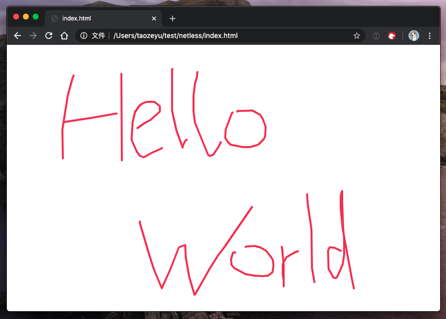

# 原生 JavaScript

本章介绍如何以纯 JavaScript 和 HTML 接入 Netless 互动白板 SDK。


在此之前，你需要在 Netless 的管理控制台注册一个企业账号，并创建一个应用。然后，获取该应用的 `App Identifier` 和，并生成该应用的 `SDK Token`。


你可以阅读[《应用与权限》](https://developer.netless.group/documents/guan-li-kong-zhi-tai/applications-and-authority)来了解具体操作。如正确操作，你将获取形如下列两个值。

```text
# App Identifier:
-_-AcIBWEeqEdX1jHT9ZPg/i25mN7NEhbum6g

# SDK Token:
NETLESSSDK_YWs9UU9JSkJobEZfYlBPLXdNeSZub25jZT0xNTg3MDkyMzUxMTQ0MDAmcm9sZT0wJnNpZz1mYmUzOTI3MjhkZmVhNTc4MzllZTdhNWQ3N2RhZjdjNjkyZmUwNzk1Y2M2MGFhMzE1Y2YxZDY1YmMxODkxNmRi
```

你需要准备一个文件夹存放 HTML 文件和 JS 文件。然后，在这个文件夹中新建一个名为 `index.html` 的文件，并用你喜欢的编辑器打开它，在其中插入如下内容。

```markup
<!DOCTYPE html>
<html>
    <head>
        <!-- 版本号根据最新版本更改即可 -->
        <link rel="stylesheet" href="https://sdk.herewhite.com/white-web-sdk/2.9.0.css">
        <script src="https://sdk.herewhite.com/white-web-sdk/2.9.0.js"></script>
        <script src="./index.js"></script>
    </head>
    <body>
        <div id="whiteboard" style="width: 100%; height: 100vh;"></div>
    </body>
</html>
```

注意其中的 `<div id="whiteboard"/>`是 Netless 互动白板的占位符。你将会通过 JavaScript 调用 White SDK 的方法，在这个 `<div/>` 注入白板的实体。

最后，在文件夹中新建名为 `index.js` 的文件，用你喜欢的编辑器打开它，在其中插入如下内容。

```javascript
var sdkToken = "阅读《应用与权限》获取 SDK Token";
var appIdentifier = "阅读《应用与权限》获取 App Identifier";

// 构造创建房间的 Request
var url = "https://shunt-api.netless.link/v5/rooms";
var requestInit = {
    method: "POST",
    headers: {
        "content-type": "application/json",
        "token": sdkToken,
    },
};

window.fetch(url, requestInit).then(function(response) {
    return response.json();

}).then(function(json) {
    // 创建房间成功，获取房间的 uuid
    var roomUUID = json.uuid;

    // 构造申请 Room Token 的 Request
    var url = "https://shunt-api.netless.link/v5/tokens/rooms/" + roomUUID;
    var requestInit = {
        method: "POST",
        headers: {
            "content-type": "application/json",
            "token": sdkToken,
        },
        body: JSON.stringify({
            "lifespan": 0, // 表明 Room Token 永不失效
            "role": "admin", // 表明 Room Token 有 Admin 的权限
        }),
    };
    fetch(url, requestInit).then(function(response) {
        return response.json();

    }).then(function(roomToken) {
        // 成功获取房间的 Room Token
        joinRoom(roomUUID, roomToken);

    }).catch(function(err) {
        console.error(err);
    });
}).catch(function(err) {
    console.error(err);
});

function joinRoom(roomUUID, roomToken) {
    var whiteWebSdk = new WhiteWebSdk({
        appIdentifier: appIdentifier,
    });
    var joinRoomParams = {
        uuid: roomUUID,
        roomToken: roomToken,
    };
    whiteWebSdk.joinRoom(joinRoomParams).then(function(room) {
        // 加入房间成功，获取 room 对象
        // 并将之前的 <div id="whiteboard"/> 占位符变成白板
        room.bindHtmlElement(document.getElementById("whiteboard"));

    }).catch(function(err) {
        // 加入房间失败
        console.error(err);
    });
}
```

使用浏览器打开 `index.html` 文件，你将看到一个空白页面。使用鼠标在该页面上写写画画，可以看到笔迹。



