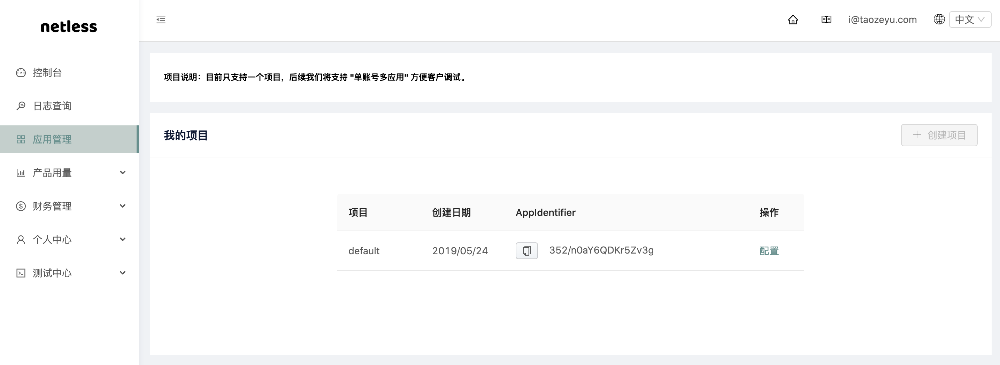

# 2.8.0 迁移指南

2.8.0 及起以后版本，在初始化 `WhiteWebSdk` 时，需要传入参数 `appIdentifier`。

```javascript
var whiteWebSdk = new WhiteWebSdk({
    ...originalConfiguration, // 你原来的参数
    appIdentifier: "{{appIdentifier}}", // 你从控制台获取的
});
```

你可以进入 [Netless 管理控制台](https://console.netless.link/)，选择应用管理页面。在「我的项目」中，可以获取项目的 App Identifier。




